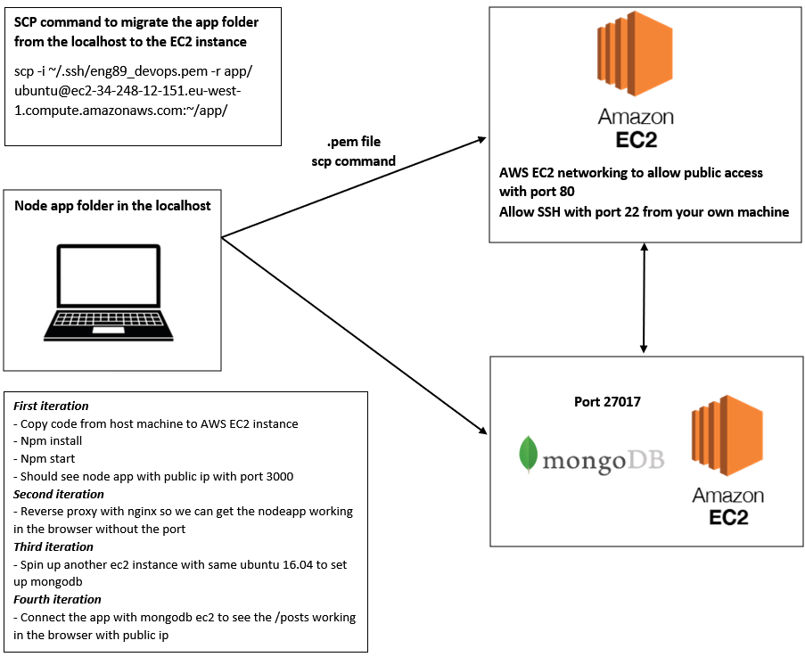

#2 Tier App Deployment - AWS
### Diagram

### First iteration 
- Copy code from host machine to AWS EC2 instance
- Npm install
- Npm start
- Should see node app with public ip with port 3000

### Second iteration
- Reverse proxy with nginx so we can get the nodeapp working in the browser without the port

### Third iteration
- Spin up another ec2 instance with same ubuntu 16.04 to set up mongodb

### Fourth iteration 
- Connect the app with mongodb ec2 to see the /posts working in the broswer with public ip

