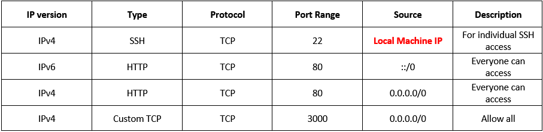
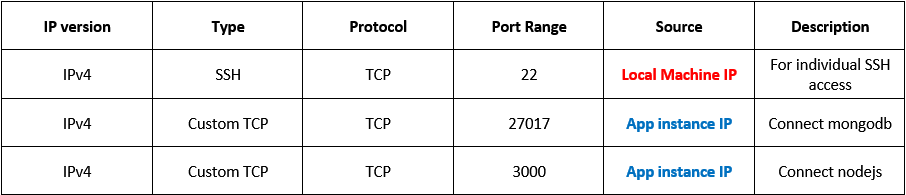

# Two Tier App Deployment - AWS

## Diagram

## Copying app to EC2 instance
- Navigate to the directory with the vagrant file in GitBash
- Run the following line `scp -i ~/.ssh/eng89_devops.pem -r app/ ubuntu@ec2-34-248-12-151.eu-west-1.compute.amazonaws.com:~/app/`
- This follows the convention `scp -i ~/.ssh/KEYPAIR -r DIRECTORYNAME/ ubuntu@EC2_INSTANCE_IP:~/LOCATION_TO_COPY_TO/`

## Creating a new instance
- Click launch instance and choose ubuntu server 16.04 (64-bit(x86))
- Choose the default instance type
- Choose subnet `DevOpsStudent default 1a` and `auto-assign public ip` to enable
- Keep default storage settings
- Add tags following naming convention `key = Name` and `value = eng89_saim_type`
- Security group for individual access `eng89_saim_SG_type`, `ssh`, `port = 22`, `MyIP` 
- Security group for group access `HTTP`, `port = 80`, `source = anywhere`
- Launch instance and choose key pair in this case `eng89_devops`
- Connect to instance, navigate to `SSH client` and copy `chmod...`
- Open GitBash, navigate to `.ssh` directory and paste the `chmod...`
- Copy `ssh -i ...` and paste it into the same directory to enter VM 

## Security group setup
### Connecting the app to the db

### Connecting the db to the app

## App instance setup

## DB instance setup

